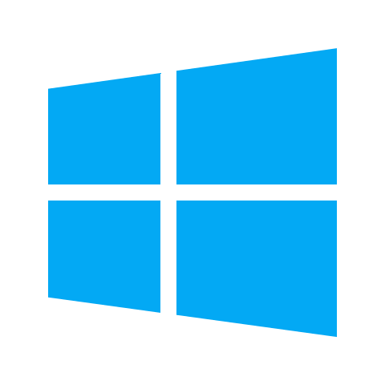

<div align="center">



# Windows 8 Web

**A pixel-perfect, fully interactive replica of Windows 8 — running entirely in the browser.**

[](https://windows8web.vercel.app/)
[](https://developer.mozilla.org/en-US/docs/Web/HTML)
[](https://developer.mozilla.org/en-US/docs/Web/CSS)
[](https://developer.mozilla.org/en-US/docs/Web/JavaScript)
[](LICENSE)

<br/>

*No frameworks. No libraries. No build tools. Pure HTML, CSS, and vanilla JavaScript.*

</div>

---

## ✨ What Is This?

**Windows 8 Web** is a complete browser-based recreation of the Microsoft Windows 8 operating system. It faithfully reproduces the look, feel, and interaction patterns of Windows 8 — from the animated boot screen and cinematic lock screen, to the Metro Start Screen with live tile flips, a fully functional system tray, and a suite of real working apps.

Every single pixel of UI, every animation, every interaction is hand-crafted in pure HTML, CSS, and vanilla JavaScript — zero npm packages, zero frameworks, zero bundlers. Open `index.html` and it runs.

The project includes five fully functional apps: **This PC** (file explorer), **Notepad** (text editor), **Command Prompt** (terminal with a built-from-scratch Java compiler and runtime), **Internet Explorer** (AI-powered browser), and **PC Settings** (personalisation panel) — all with proper window management, drag, resize, minimise, maximise, and close behaviours.

---

## 🚀 Live Demo

> **[https://windows8web.vercel.app/](https://windows8web.vercel.app/)**

Works on desktop and mobile browsers.

---

## 🎬 Full Feature Breakdown

### 🖥️ Boot Screen
- Pure black background with `logo.png` centred, fading and scaling in on load
- **8-dot circular spinner** — each dot pulses in sequence at staggered delays, matching the exact Windows 8 boot animation visually
- 2.3-second boot sequence before transitioning to the lock screen

### 🔒 Lock Screen
- Custom wallpaper (`67.jpg`) with a dark gradient overlay for text readability
- **Live clock and date** — updates every second
- **Two-stage cinematic unlock animation:**
  - Stage 1: A subtle 18px upward nudge on first click (responsiveness feedback)
  - Stage 2: A slow 900ms slide-up reveal of the desktop
- Battery and Wi-Fi status icons in the bottom-right corner

### 🖼️ Desktop
- Wallpaper background with a radial vignette overlay
- Desktop icons: This PC, Documents, Recycle Bin, Internet Explorer, Notepad, Command Prompt
- Double-click any icon to launch its app
- **Right-click on empty desktop** → context menu with View, Refresh, New (Folder / Shortcut / Text Document), Display Settings, Personalise, Properties
- **Right-click on icons** → app-specific context menus (Open, Rename greyed, Delete greyed, Properties)

### 🪟 Start Screen
- Opens with a smooth **slide-up animation** from the taskbar
- `"Start"` title top-left in authentic Windows 8 light-weight font
- **User block** top-right with avatar (`user.png`) and a **power dropdown** that slides down smoothly
- Power dropdown: Lock, Sign out, Other user (disabled), Sleep, Shut down, Restart
- **5 tile column groups** — each column staggers in from the right with a scale-up animation (80ms delay per column) on open
- Tiles have **transparent borders by default** that appear on hover, compress inward on press — matching the real Metro UI interaction model
- **Wallpaper visible behind** a dark semi-transparent overlay

### 📌 Live Tiles
Six tiles animate with a **3D X-axis flip** to reveal live content on the back face, each on its own independent timer:

| Tile | Live Content |
|------|-------------|
| Mail | Unread message count and inbox status |
| Calendar | Current day number and month name |
| Weather | Temperature and weather conditions |
| Music | Now Playing track and artist |
| News | Breaking headline text |
| Bing | Daily photo caption |

### ⚙️ PC Settings (Personalise)
Full-screen Windows 8 style settings panel with 12 pages:

**Personalise** (3 sub-tabs):
- **Lock screen** — live preview with ticking clock overlay, wallpaper picker strip (10 wallpapers from `wallpapers/` folder + default), Browse button to upload from device. Selecting any wallpaper **instantly changes the real lock screen background**.
- **Start screen** — 20-colour accent colour grid, selecting a colour changes the start screen background live. Wallpaper strip also changes the desktop and start screen backgrounds.
- **Account picture** — shows `user.png` with name **Neel Patel**, Browse button to upload a new photo — updates the Start Screen avatar instantly everywhere.

**Other pages:** Notifications (5 toggles), Search (3 toggles + SafeSearch dropdown), General (5 toggles + brightness slider), Privacy (4 toggles), Devices (printer / Bluetooth / mobile), Wireless (Wi-Fi / Bluetooth / Airplane mode), Ease of Access (4 toggles), Sync your settings (5 toggles), HomeGroup, Windows Update (live date, auto-update toggle, check button), Share.

**Close:** ✕ button top-right, or press **Escape**. Slides out with a reverse animation.

### 🔌 Shutdown
- Triggered from power dropdown in Start Screen or PC Settings
- Full overlay with Sleep, Shut down, Restart
- Shut down: fade-to-black with Windows logo
- Restart: reloads the page
- Sleep: screen dims to black, click anywhere to wake

---

## 🖥️ Apps

### 📁 This PC (File Explorer)

A fully functional Windows File Explorer style app:

**Window system:**
- Draggable by title bar, resizable from bottom-right corner handle
- Minimise → smooth animation to taskbar, click taskbar entry to restore
- Maximise → fills full viewport, button icon toggles between square and clone symbol
- Close → removes with fade-out animation
- Double-click title bar to toggle maximise

**Ribbon toolbar:**
- Computer tab: New Folder, Open, Rename, Delete, Properties
- View tab: Large Icons, List view, Sort by name, Sort by type

**Navigation:**
- Back / Forward / Up buttons with full per-session history stack
- Address bar updates at every step with path breadcrumb and matching icon
- Sidebar: Favourites (Desktop, Downloads, This PC) and Devices shortcuts
- Live search — filters items in current folder as you type

**This PC view:**
- 4 drive tiles: Windows (C:), Data (D:), USB Drive (E:), DVD Drive (F:)
- Each drive shows a colour-coded **storage progress bar**:
  - 🔵 Blue — healthy (under 60% full)
  - 🟡 Yellow — moderate (60–85% full)
  - 🔴 Red — critical (above 85% full)
- Free space and total capacity shown below each drive name
- 6 system folder shortcuts: Desktop, Documents, Downloads, Music, Pictures, Videos

**Virtual file system:**
- Pre-populated with realistic folders and files across all locations
- **New Folder** — creates with the name input already selected, duplicate names auto-increment
- **Rename** — click name or press F2, confirm with Enter, cancel with Escape
- **Delete** — Delete key or ribbon button
- **Right-click context menu** — New folder, Open, Rename, Delete, Properties
- **Keyboard shortcuts** — F2 rename, Delete delete, Backspace navigate back
- **Double-click `.txt` or `.java` files** → opens them directly in Notepad

---

### 📝 Notepad

A full-featured text editor supporting multiple file types including `.java`, `.txt`, `.py`, `.html`, `.css` and more.

**File menu:**
- New — creates a new blank tab
- Open — dialog listing all saved files in Documents, with Browse to open from device
- Save — writes to virtual FS Documents; prompts for filename on first save (preserves any extension — `.java`, `.txt`, etc.)
- Save As — always prompts, preserves typed extension
- Download file — downloads to your real device as the correct file type
- Exit — warns if unsaved tabs exist

**Edit menu — all working:**
Cut, Copy, Paste, Delete, Select All, Undo, Find (Ctrl+F), Find Next (F3), Replace (Ctrl+H), Go To Line (Ctrl+G), Insert Date/Time (F5)

**Find bar:**
Slides open below menu bar. Wraps around on reaching end. Replace mode shows second input field + Replace / Replace All buttons.

**Format menu:**
- Word Wrap toggle with checkmark
- Font dialog — family (8 options), style (normal / italic / bold / bold italic), size, live preview

**View menu:**
- Status Bar toggle
- Zoom In / Out / Reset (Ctrl++ / Ctrl+- / Ctrl+0)

**Status bar:**
Live Line + Column position, word count, character count, encoding label (UTF-8).

**Saved notes sidebar:**
Left panel showing all text files from Documents. Red dot = unsaved changes. Click to switch tabs. Files saved in Notepad appear in This PC → Documents.

**Right-click menus:**
- On editor textarea: Cut, Copy, Paste, Delete, Select All, Find, Replace, Font
- On sidebar file entries: Open, Rename, Delete, Save
- On title bar: Restore, Minimise, Maximise, Close

**Java file support:**
Write Java code, save as `ClassName.java` (the exact class name must match the filename). The file appears immediately in This PC → Documents and is accessible from the Terminal.

---

### ⌨️ Command Prompt (Terminal)

A fully working terminal with a **built-from-scratch Java compiler and runtime engine** implemented entirely in JavaScript.

**Window:** Draggable, resizable, minimise/maximise/close. Dark `#0c0c0c` background, cyan prompt, colour-coded output. Status bar shows current directory and Java version.

**Menu bar:** File (Clear / Exit), Edit (Copy / Paste / Select All / Clear), View (Zoom), Help (Commands / About)

**Built-in commands — all work with the virtual file system:**

| Command | Behaviour |
|---------|-----------|
| `dir` / `ls` | Lists files and folders with sizes, timestamps, file count and bytes free |
| `cd <path>` | Changes directory — supports `..`, drive letters, `documents`, `desktop`, `downloads` shortcuts |
| `mkdir <name>` | Creates a folder in virtual FS (visible in This PC immediately) |
| `del <file>` | Deletes a file from virtual FS |
| `type <file>` | Displays file contents — including Java source code |
| `copy <src> <dst>` | Copies a file |
| `move <src> <dst>` | Moves a file |
| `ren <old> <new>` | Renames a file |
| `echo <text>` | Prints text |
| `set` | Shows all environment variables (PATH, JAVA_HOME, etc.) |
| `date` / `time` | Current date / time |
| `ver` | Windows version string |
| `whoami` | `nx4real-pc\nx4real` |
| `hostname` | `NX4REAL-PC` |
| `ipconfig` | Full network info with IPv4, subnet, gateway for both Ethernet and Wi-Fi |
| `ping <host>` | Simulates 4 pings with realistic RTT values and statistics |
| `tree` | Directory tree of current folder |
| `tasklist` | Running processes list including `java.exe`, `notepad.exe`, `cmd.exe` |
| `systeminfo` | Full system info — Owner: **Neel Patel**, Org: **nx4real**, 8GB RAM, i7 processor |
| `path` | Shows the PATH environment variable |
| `cls` / `clear` | Clears terminal output |
| `help` | Lists all commands |
| `exit` | Closes the terminal |

**Quality of life:**
- ↑ / ↓ arrow keys — navigate command history
- Tab — autocomplete filenames from current directory
- Ctrl+C — interrupt current input
- Ctrl+L — clear screen

**Output colour coding:**
- 🟢 Green — Java program output
- 🔵 Cyan — system / info messages
- 🟡 Yellow — hints and warnings
- 🔴 Red — errors and exceptions
- ⚪ White — normal command output

**Right-click menus:**
- On terminal body: Copy, Paste, Select All, Clear, Close
- On title bar: Restore, Minimise, Maximise, Close

#### ☕ Java Compiler & Runtime Engine

The most complex feature of the project — a full Java interpreter written in JavaScript from scratch. No external libraries.

**Stage 1 — Tokenizer:**
Reads raw Java source code character-by-character and produces a token stream. Handles all Java token types: keywords, identifiers, string/char/number literals, operators, punctuation. Skips `//` and `/* */` comments. Handles escape sequences (`\n`, `\t`, `\\`). Multi-character single-quoted strings are treated as String literals (forgiving mode).

**Stage 2 — Recursive Descent Parser:**
Walks the token stream and builds a complete Abstract Syntax Tree (AST). Supports:
- Class declarations, fields, static/instance methods, constructors
- Full expression parsing with correct operator precedence (BODMAS): arithmetic, comparison, logical, ternary `? :`, pre/post `++/--`, compound assignment `+= -= *= /= %=`
- All statement types: `if/else`, `for`, `while`, `do-while`, `switch/case/default`, `try/catch/finally`, `throw`, `return`, `break`, `continue`
- Method calls, field access (`System.out`), array access, `new` expressions
- Validates that the public class name must match the filename — produces a compile error if it does not

**Stage 3 — Compiler:**
Stores the parsed AST in a `compiledClasses` object in memory. Also creates actual `.class` files in the virtual FS Documents folder, visible in This PC.

**Stage 4 — Runtime Executor (`JavaRuntime` class):**
Walks the AST and executes it with full scoped environments (each block/method gets its own variable scope with parent chain — exactly how the JVM stack frames work). Includes call stack protection (throws `StackOverflowError` after 500 recursive calls) and loop protection (throws after 100,000 iterations).

**Supported Java features:**

Data types: `int`, `long`, `double`, `float`, `boolean`, `char`, `String`, arrays `int[]`, `String[]`

Control flow: `if/else`, `while`, `for`, `do-while`, `switch/case/default`, `break`, `continue`, `return`, `try/catch/finally`, `throw`

OOP: classes, instance fields, static fields, instance methods, static methods, constructors, `this`, `new`, user-defined class instantiation and method calls between classes

Built-in Java class support:

| Class | Supported methods |
|-------|-------------------|
| `System.out` | `println`, `print`, `printf`, `format` |
| `Math` | `abs`, `sqrt`, `pow`, `max`, `min`, `floor`, `ceil`, `round`, `log`, `log10`, `sin`, `cos`, `tan`, `random`, `PI`, `E` |
| `String` | `length`, `charAt`, `substring`, `indexOf`, `lastIndexOf`, `contains`, `startsWith`, `endsWith`, `replace`, `replaceAll`, `toLowerCase`, `toUpperCase`, `trim`, `split`, `toCharArray`, `equals`, `equalsIgnoreCase`, `isEmpty`, `concat`, `format`, `matches` |
| `StringBuilder` | `append`, `toString`, `length`, `charAt`, `reverse`, `deleteCharAt`, `insert` |
| `Integer` | `parseInt`, `toBinaryString`, `toHexString`, `MAX_VALUE`, `MIN_VALUE` |
| `Double` | `parseDouble`, `isNaN`, `MAX_VALUE`, `MIN_VALUE`, `NaN` |
| `Arrays` | `sort`, `fill`, `toString`, `copyOf` |
| `ArrayList` | `add`, `get`, `size`, `remove`, `contains`, `toString` |
| `HashMap` | `put`, `get`, `containsKey`, `size`, `keySet`, `toString` |
| `HashSet` | `add`, `contains`, `size`, `remove`, `toString` |
| `Collections` | `sort`, `reverse`, `max`, `min` |
| `Random` | `nextInt`, `nextDouble`, `nextBoolean` |
| `String.format` / `printf` | Full format specifiers: `%d`, `%f`, `%s`, `%c`, `%b`, `%o`, `%x`, `%X`, `%n` |

**The Java workflow:**

```
1. Open Notepad → write Java code → save as ClassName.java (goes to Documents)

2. Open Terminal → cd documents (or javac searches Documents automatically)

3. javac ClassName.java
   → Tokenize → Parse → Validate class name matches filename
   → On success: ClassName.class created in virtual FS
   → Shows: ✔ Compilation successful — 1 class(es) compiled
   → Suggests: Run it with: java ClassName

4. java ClassName
   → Loads compiled AST
   → Executes main() method
   → Output printed in green
   → Runtime exceptions shown in red
```


---

## 🔗 App Integration

All five apps share the same virtual file system object (`FS`) — any change in one app is immediately visible in others:

- **Save a `.txt` or `.java` file in Notepad** → it appears instantly in This PC → Documents
- **Create a folder with `mkdir` in Terminal** → it appears in This PC
- **`del` a file in Terminal** → it's removed from This PC
- **`javac` compiles a `.java` file** → a `.class` file appears in This PC → Documents
- **Double-click a `.txt` or `.java` file in This PC** → opens it directly in Notepad with content loaded
- **Settings wallpaper change** → instantly updates the actual desktop and lock screen backgrounds

---

## 📁 Project Structure

```
windows8-web/
│
├── index.html          # Main entry — all screens, context menus, tray panels, shutdown overlay
├── style.css           # Core styles — boot, lock, desktop, start screen, taskbar, tray, settings
├── main.js             # Core logic — boot, lock, clock, start, tray panels, context menus, shutdown
│
├── thispc.css          # This PC app — window, ribbon, address bar, drives, file grid, context menu
├── thispc.js           # This PC app — virtual FS, navigation history, CRUD, drag, resize
│
├── notepad.css         # Notepad app — window, menu bar, find bar, editor, sidebar, font dialog
├── notepad.js          # Notepad app — tabs, save/open/download, find/replace, font, right-click menus
│
├── terminal.css        # Terminal app — CMD window, menu bar, input row, status bar, context menus
├── terminal.js         # Terminal app — all commands, Java tokenizer, parser, compiler, runtime engine
│
├── settings.css        # PC Settings — full-screen panel, sidebar nav, personalise tabs, toggles
├── settings.js         # PC Settings — wallpaper apply, accent colours, account picture, 12 pages
│
├── ie.css              # Internet Explorer — browser window, navbar, tabs, results page, loading bar
├── ie.js               # Internet Explorer — tab system, navigation, AI search via Anthropic API
│
├── logo.png            # Windows logo — boot screen + taskbar start button
├── 67.jpg              # Default wallpaper — desktop + lock screen
├── user.png            # User account picture — Start Screen avatar
│
├── wallpapers/
│   ├── wp1.jpg         # Mountain Lake
│   ├── wp2.jpg         # City Lights
│   ├── wp3.jpg         # Forest Path
│   ├── wp4.jpg         # Ocean Sunset
│   ├── wp5.jpg         # Desert Dunes
│   ├── wp6.jpg         # Snow Peaks
│   ├── wp7.jpg         # Autumn Leaves
│   ├── wp8.jpg         # Night Sky
│   ├── wp9.jpg         # Tropical Beach
│   └── wp10.jpg        # Abstract Blue
│
└── icons/
    ├── computer.png        # This PC — desktop + sidebar
    ├── folder.png          # Folders everywhere
    ├── recycle.png         # Recycle Bin
    ├── ie.png              # Internet Explorer
    ├── notepad.png         # Notepad
    ├── terminal.png        # Command Prompt
    ├── explorer.png        # File Explorer (taskbar)
    ├── mediaplayer.png     # Windows Media Player (taskbar)
    │
    ├── mail.png            # Start Screen tiles
    ├── calendar.png
    ├── news.png
    ├── people.png
    ├── finance.png
    ├── messaging.png
    ├── weather.png
    ├── store.png
    ├── maps.png
    ├── skydrive.png
    ├── skype.png
    ├── travel.png
    ├── bing.png
    ├── games.png
    ├── camera.png
    ├── photos.png
    ├── music.png
    ├── video.png
    ├── settings.png
    ├── onenote.png
    │
    ├── tray-wifi.png       # System tray icons
    ├── tray-volume.png
    ├── tray-battery.png
    ├── tray-action.png
    ├── tray-language.png
    │
    ├── drive-system.png    # This PC — drive icons
    ├── drive-hdd.png
    ├── drive-usb.png
    ├── drive-dvd.png
    │
    ├── file-text.png       # File type icons
    ├── file-image.png
    ├── file-word.png
    ├── file-excel.png
    ├── file-exe.png
    ├── file-audio.png
    ├── file-video.png
    ├── file-zip.png
    └── file-sys.png
```


## 🎮 How to Use

| Action | What happens |
|--------|-------------|
| **Click** lock screen | Cinematic slide-up unlock |
| **Double-click** desktop icon | Opens the app |
| **Right-click** desktop | Context menu |
| **Right-click** icon | App-specific context menu |
| **Click** Windows logo (taskbar) | Opens / closes Start Screen |
| **Scroll** Start Screen | Horizontal tile scroll |
| **Click** a tile | Opens that app or function |
| **Hover** right screen edge | Charms bar slides in |
| **Click** clock | Opens calendar popup |
| **Click** volume icon | Opens volume slider |
| **Click** Wi-Fi icon | Opens network panel |
| **Hover** battery | Tooltip with percentage |
| **Right-click** taskbar app | Close / Pin options |
| **Drag** window title bar | Move window |
| **Drag** window corner | Resize window |
| **Double-click** title bar | Maximise / restore |
| **Escape** key | Close Start Screen / panels / Settings |
| **F2** in This PC / Notepad | Rename selected item |
| **Delete** in This PC | Delete selected item |
| **Backspace** in This PC | Navigate back |
| **Ctrl+S** in Notepad | Save file |
| **Ctrl+F** in Notepad | Find bar |
| **↑ / ↓** in Terminal | Command history |
| **Tab** in Terminal | Autocomplete filename |
| **javac file.java** | Compile Java source file |
| **java ClassName** | Run compiled Java class |

---

## 🏗️ Architecture

### Per-feature file pattern

Each major feature has its own isolated CSS and JS file. The core OS (boot, lock, desktop, start screen, taskbar, tray) lives in `style.css` + `main.js`. Every app is fully self-contained:

```
Feature              CSS file          JS file
────────────────────────────────────────────────
Core OS              style.css         main.js
This PC              thispc.css        thispc.js
Notepad              notepad.css       notepad.js
Command Prompt       terminal.css      terminal.js
PC Settings          settings.css      settings.js
Internet Explorer    ie.css            ie.js
```

### Key design decisions

**JS-calculated tile sizes** — tile dimensions are computed from the actual measured `clientHeight` of the metro area on every open, stamping real pixel values onto each CSS grid. This guarantees tiles never overflow or leave gaps on any screen size.

**`visibility: hidden` for inactive overlays** — the Start Screen uses `visibility: hidden` + `pointer-events: none` when closed with a transition delay matching the slide-out animation. This prevents off-screen elements from bleeding through on any browser.

**Shared virtual FS** — a single global `FS` object is the source of truth for all file operations across all apps. No localStorage, no IndexedDB — zero persistence complexity.

**Java interpreter architecture** — the compiler is a classic 4-stage pipeline: tokenizer → recursive descent parser → AST → tree-walking interpreter. The runtime uses a prototype-based `Environment` class for scoped variable lookup, mirroring JVM stack frame semantics.

**AI search via direct API call** — Internet Explorer calls the Anthropic Claude API with a structured system prompt requesting Google-style search result JSON. A client-side fallback ensures the page always renders even if the API is unavailable.

---

## 🗺️ Roadmap

- [ ] **Multiple window z-index focus** — click to bring any window to front, proper stacking
- [ ] **Window snap** — drag to screen edge to snap side-by-side (Win8 Snap Assist)
- [ ] **Recycle Bin** — collects deleted files, restore or empty permanently
- [ ] **Photos app** — image gallery with slideshow, zoom, the Photos live tile shows real images
- [ ] **Calculator** — standard + scientific mode, Win8 exact look
- [ ] **Paint** — canvas drawing with colour picker, brush sizes, save as PNG download
- [ ] **Alt+Tab switcher** — animated app switcher overlay like real Windows
- [ ] **Start Screen search** — type while Start Screen is open to filter tiles live
- [ ] **Touch / swipe gestures** — swipe from left for app switcher, right for charms

---

## 🤝 Contributing

1. Fork the repository
2. Create a feature branch — `git checkout -b feature/calculator-app`
3. Follow the per-feature file pattern — create `yourapp.css` and `yourapp.js`
4. Keep it dependency-free — no npm packages, no frameworks
5. Wire it into `index.html` (CSS link in `<head>`, script tag before `</body>`, desktop icon + context menu)
6. Open a pull request

---

## 📜 License

MIT License — see [LICENSE](LICENSE) for details.

> **Disclaimer:** This is a fan-made educational project. Windows, Windows 8, Internet Explorer, and all related names and logos are trademarks of Microsoft Corporation. This project is not affiliated with, endorsed by, or connected to Microsoft in any way. The Anthropic Claude API is used solely to power the AI search feature.

---

## 🙏 Acknowledgements

- **[Font Awesome](https://fontawesome.com/)** — icons used throughout the UI
- **[Google Fonts — Segoe UI](https://fonts.google.com/)** — matching the Windows 8 system font
- **[Anthropic Claude API](https://www.anthropic.com/)** — powering AI-driven search in Internet Explorer
- **Microsoft Windows 8** — the original design that inspired every pixel of this project

---

<div align="center">

Built with ❤️ and a whole lot of nostalgia by **[nx4real](https://github.com/neelpatel112)**

**[⭐ Star this repo](https://github.com/neelpatel112/windows_8_web)** · **[🐛 Report a bug](https://github.com/neelpatel112/windows_8_web/issues)** · **[💡 Request a feature](https://github.com/neelpatel112/windows_8_web/issues)**

</div>
 